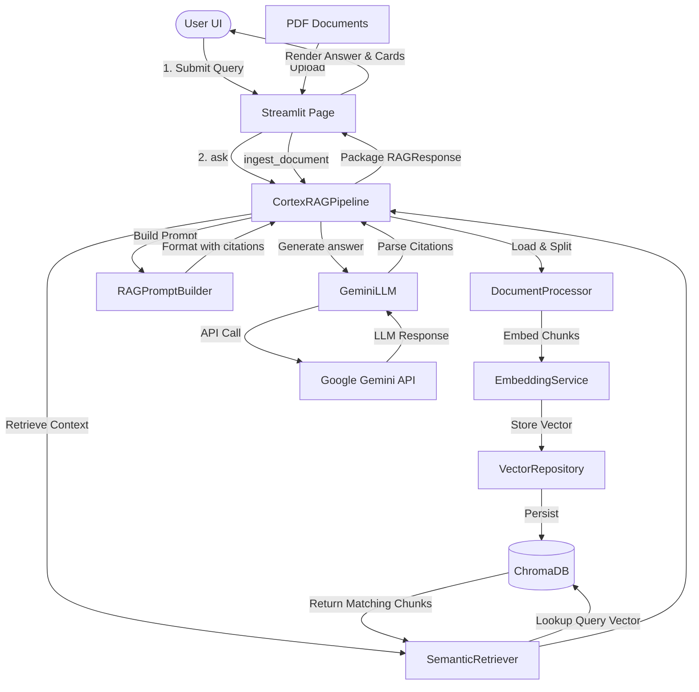

# 🧠 Cortex AI - Production-Ready RAG Knowledge Assistant

Cortex AI is an enterprise-grade, modular **Retrieval-Augmented Generation (RAG)** pipeline designed to ingest, chunk, embed, and index PDF documents into a local vector store, allowing users to ask context-informed questions and receive cited answers from an LLM.

---

## 🚀 Key Features

* **Modular Clean Architecture**: Adheres to SOLID design principles; core engines (Retrieval, Prompts, LLMs, Vector Databases) are abstracted and fully decoupled.
* **Intelligent Document Ingest**: PDF loading, semantic character chunking, SHA-256 duplicate checks, and incremental versioning.
* **Robust Embedding Cache**: Employs in-memory SHA-256 caching to minimize embedding generator latencies and API costs.
* **Dual Retrieval Strategies**: Perform similarity search or Maximum Marginal Relevance (MMR) ranking with metadata filtering.
* **Context Token Budgeting**: Compresses context passages dynamically to fit prompt limits while generating inline source citations.
* **Fault-Tolerant LLM Inference**: Communicates with Google Gemini using exponential backoff retry parameters and safety settings.
* **Conversational Memory**: Chat sessions log conversational turns to support follow-up questions.
* **Premium Frontend**: Dark-slate glassmorphism dashboard built with Streamlit including Document Managers, Chat Panels, Performance Analytics, and configurations.
* **Production Packaging**: Dockerized service configurations, automated GitHub Actions CI, and pre-commit linting checks.

---

## 📂 Project Structure

```text
cortex-ai/
├── .github/workflows/   # CI automation scripts
│   └── ci.yml
├── core/                # Core implementation packages
│   ├── document_processor.py
│   ├── chunker.py
│   ├── pdf_loader.py
│   ├── embeddings.py
│   ├── exceptions.py    # Custom domain exception classes
│   ├── vector_store/    # Database adapters (ChromaDB)
│   ├── repository/      # Repository layers (metadata & statistics)
│   ├── retriever/       # MMR and Similarity retrieval strategy builders
│   ├── prompt/          # Prompt templates & context compressions
│   ├── llm/             # LLM API handlers (Google Gemini)
│   └── rag/             # Orchestrator and sessions manager
├── ui/                  # Streamlit Multi-page presentation layer
│   ├── app.py           # Landing home page
│   ├── pages/           # Chat, Ingest, Analytics, Settings, About
│   ├── components/      # Reusable UI component blocks
│   └── styles/          # Custom CSS declarations
├── tests/               # Unit, integration, and compilation test suite
├── docs/                # Comprehensive architecture and user guides
├── scripts/             # Automated environment validation scripts
├── Dockerfile           # Multi-stage release configuration
└── docker-compose.yml   # Volume and environment mounting config
```

---

## 🛠️ System Architecture



---

## 📥 Installation and Setup

### Prerequisites
* Python 3.11+
* Gemini API Key ([Get it from Google AI Studio](https://aistudio.google.com/))

### 1. Clone and Install
```bash
git clone https://github.com/Raj96422/cortex-ai.git
cd cortex-ai
python -m venv venv
source venv/bin/activate  # On Windows use: venv\Scripts\activate
pip install -r requirements.txt
```

### 2. Configuration
Copy the environment template and insert your Gemini API Key:
```bash
cp .env.example .env
```
Inside `.env`:
```env
GEMINI_API_KEY=AIzaSy...your_gemini_key
```

### 3. Run the App
Launch the Streamlit dashboard:
```bash
streamlit run ui/app.py
```
Open your browser and navigate to `http://localhost:8501`.

---

## 🐳 Docker Deployment

To launch the entire system inside a Docker container:
```bash
docker-compose up --build
```
This builds the multi-stage environment, mounts local directories (`chroma_db`, `pdfs`, `logs`) as volumes, and exposes the interface on `http://localhost:8501`.

---

## 🧪 Running Tests

Cortex AI features a test suite with 68 unit, integration, and UI compilation checks.
To execute all tests:
```bash
python -m unittest discover -s tests
```

---

## 📄 License
This project is licensed under the MIT License - see the [LICENSE](LICENSE) file for details.
