# 🧠 Cortex AI - Intelligent Knowledge Assistant

Cortex AI is a production-quality Intelligent Knowledge Assistant that implements a robust Retrieval-Augmented Generation (RAG) pipeline. It enables users to upload multiple PDF documents and engage in context-aware conversations. The system is designed to respond **only** based on the contents of the uploaded files, citing the specific source names and page numbers.

---

## 🔍 Project Overview

Cortex AI leverages modern Natural Language Processing techniques to solve the common issue of LLM hallucinations. By restricting the model's knowledge base to user-uploaded PDFs (using semantic search via vector database embeddings), Cortex AI serves as a reliable, context-locked enterprise search assistant.

---

## 🛠️ Tech Stack

*   **Frontend UI**: [Streamlit](https://streamlit.io/) (with custom dark glassmorphic styling)
*   **Orchestration Framework**: [LangChain](https://www.langchain.com/)
*   **Large Language Model**: [Google Gemini API](https://ai.google/) (via `langchain-google-genai`)
*   **Text Embeddings**: [Google GenAI Embeddings](https://ai.google/)
*   **Vector Database**: [ChromaDB](https://www.trychroma.com/) (Persistent local storage)
*   **Document Parsing**: [PyPDF](https://pypi.org/project/pypdf/)
*   **Config & Logging**: [python-dotenv](https://pypi.org/project/python-dotenv/) & Python's native `logging` library

---

## 📐 Architecture Diagram

Below is the logical flow of the Cortex AI RAG system:

```mermaid
flowchart TD
    subgraph Data Ingestion
        A[Upload PDF Documents] --> B[PyPDF Parser]
        B --> C[Recursive Character Text Splitter]
        C --> D[Google GenAI Embeddings]
        D --> E[(Persistent ChromaDB Store)]
    end

    subgraph Chat & Retrieval Pipeline
        F[User Question] --> G[Query Embedding]
        G --> H[Semantic Retrieval from ChromaDB]
        H --> I[Context Formation with Citations]
        I --> J[Prompt Formatting with Chat History]
        J --> K[Google Gemini Model]
        K --> L[Answer & Citations Generation]
        L --> M[Update UI & Chat History]
    end
```



---

## 🚀 Features

*   **Multi-PDF Processing**: Upload, parse, and index multiple PDF files in parallel.
*   **Context-Locked Answers**: Strict prompt constraints prevent the assistant from using external or pre-trained knowledge.
*   **Source Citations**: Every answer provides clickable source citations with exact page numbers.
*   **Sleek Dark UI**: Customized Streamlit CSS providing a modern, developer-friendly interface.
*   **Persistent Storage**: Embeddings are stored in a persistent local directory (`chroma_db/`) so you do not have to re-upload files on restart.
*   **Interactive History Management**: Options to clear chat history, wipe the vector store, or export transcripts to Markdown.
*   **Robust Logging**: Trace events and debugging output easily through standard logs folder.

---

## 📁 Folder Structure

```text
cortex-ai/
├── assets/             # UI assets, static images, and stylesheet sources
├── chroma_db/          # Persistent ChromaDB vector store files (git-ignored)
├── core/               # Core business and RAG logic modules
│   ├── chunker.py      # Text segmentation & chunking
│   ├── embeddings.py   # Embedding generator
│   ├── llm.py          # Google Gemini model wrapper
│   ├── pdf_loader.py   # PDF text extraction
│   ├── rag_pipeline.py # Orchestrates chunking, embeddings, database, and LLM
│   ├── retriever.py    # Vector store query & citation extractor
│   └── vector_store.py # Database initializers
├── exports/            # Exported Markdown chat transcripts (git-ignored)
├── logs/               # Output runtime logs (git-ignored)
├── pages/              # Streamlit multi-page app routing
├── pdfs/               # Temporary directory for uploaded files (git-ignored)
├── screenshots/        # Images for repository documentation
├── tests/              # Unit and integration test suite
├── utils/              # Utility configurations and scripts
│   ├── __init__.py     # Package initialization
│   ├── config.py       # Configuration and environment loaders
│   ├── constants.py    # Centralized app constants and strings
│   ├── helpers.py      # Size formatters, export utilities, etc.
│   ├── logger.py       # Log handler setups (console and file)
│   └── styles.py       # CSS override files
├── .env.example        # Reference environment configuration
├── .gitignore          # Git exclusion rules
├── app.py              # Main dashboard entry point
├── LICENSE             # MIT License details
├── README.md           # Project documentation
└── requirements.txt    # Python dependency requirements
```

---

## ⚙️ Installation & Setup

### Prerequisites
*   Python 3.11+
*   Google Gemini API Key (obtained from [Google AI Studio](https://aistudio.google.com/))

### 1. Clone the Repository
```bash
git clone https://github.com/yourusername/cortex-ai.git
cd cortex-ai
```

### 2. Configure Virtual Environment
**Windows (PowerShell):**
```powershell
python -m venv .venv
.venv\Scripts\Activate.ps1
```
**macOS/Linux:**
```bash
python3 -m venv .venv
source .venv/bin/activate
```

### 3. Install Dependencies
```bash
pip install --upgrade pip
pip install -r requirements.txt
```

### 4. Set Environment Variables
Copy `.env.example` to `.env`:
```bash
cp .env.example .env
```
Provide your API key in the `.env` file:
```env
GOOGLE_API_KEY=your_actual_gemini_api_key
```

---

## 🏃 Running the Project

Start the Streamlit application:
```bash
streamlit run app.py
```
Open `http://localhost:8501` in your browser.

---

## 🖼️ Screenshots
*(Screenshots will be added as UI development progresses)*

---

## 🔮 Future Enhancements
*   Hybrid search support (Sparse BM25 + Dense embeddings).
*   Automatic chunk size optimization.
*   Support for multiple workspace/collection databases.
*   Integration with local LLMs (Ollama).

---

## 📄 License
Distributed under the MIT License. See [LICENSE](file:///e:/Cortex%20Ai/LICENSE) for details.
