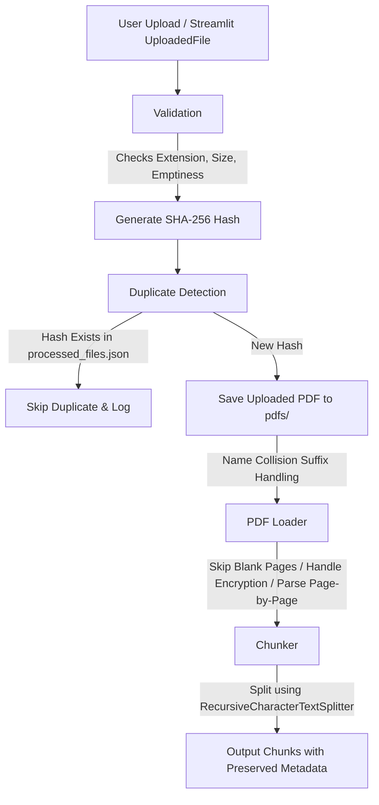

# Ingestion Pipeline Architecture

This document describes the architectural flow and software engineering principles of the Cortex AI Intelligent Document Ingestion Pipeline.

## Architectural Flow

The pipeline operates in a sequential, deterministic flow where inputs are validated, stored, parsed, chunked, and registered for downstream indexing.

### Detailed Ingestion Steps

1. **User Upload**:
   Files are received as binary file streams (e.g. Streamlit `UploadedFile` streams or python file-like objects).
   
2. **Validation**:
   The orchestrator checks:
   - **Extension**: Only files ending with `.pdf` (case-insensitive) are accepted (configured in `ALLOWED_EXTENSIONS` from [constants.py](file:///e:/Cortex%20Ai/utils/constants.py)).
   - **Emptiness**: Files with `0` bytes are skipped.
   - **File Size**: Files exceeding the size limit (e.g. `MAX_FILE_SIZE_MB` from [constants.py](file:///e:/Cortex%20Ai/utils/constants.py)) are rejected.
   
3. **SHA-256 Hash Generation**:
   A cryptographic SHA-256 checksum is generated based on the file content. This checksum uniquely identifies the document.
   
4. **Duplicate Detection**:
   The generated hash is compared against the registry database (`pdfs/processed_files.json`). If the hash is found, the file is classified as a duplicate and skipped.
   
5. **Save Uploaded PDF**:
   New documents are saved inside the local `pdfs/` storage directory. If a file with the same filename already exists on disk (but has a different content hash), the orchestrator appends the first 8 characters of the content hash to the saved name (e.g., `report_a2f8b9e1.pdf`) to avoid overwriting files.
   
6. **PDF Loader**:
   Invokes the extraction module to read pages from the saved path.
   - Page text is parsed page-by-page.
   - Blank pages containing no text are filtered out.
   - If the file is encrypted, the loader tries empty-password decryption.
   - It builds LangChain `Document` objects with precise metadata tags for downstream tracking.
   
7. **Chunker**:
   The documents are parsed into overlapping text chunks using `RecursiveCharacterTextSplitter`.
   - Groups pages by `document_id` and sorts them chronologically.
   - Chunks text based on `DEFAULT_CHUNK_SIZE` and `DEFAULT_CHUNK_OVERLAP` constants.
   - Injects relative, sequential tracking identifiers (`chunk_index`, `chunk_id`) on each chunk.
   
8. **Output Chunks**:
   The generated list of LangChain `Document` chunks is returned to the ingestion caller.

---

## Architectural Principles

### 1. Clean Architecture & Separation of Concerns
The ingestion system partitions tasks into focused, decoupled components:
- **Exceptions**: Centralized domain error models defined in [exceptions.py](file:///e:/Cortex%20Ai/core/exceptions.py).
- **Extraction (PDF Loader)**: Encapsulated strictly in [pdf_loader.py](file:///e:/Cortex%20Ai/core/pdf_loader.py) with no dependency on upload formats, hashing, or chunking.
- **Splitter (Chunker)**: Encapsulated in [chunker.py](file:///e:/Cortex%20Ai/core/chunker.py), parsing only standard `Document` objects.
- **Orchestration (Document Processor)**: Placed in [document_processor.py](file:///e:/Cortex%20Ai/core/document_processor.py), which implements storage, validation, and calling logic.

### 2. SOLID Design Principles
- **Single Responsibility (SRP)**: Each class/module performs exactly one task. `PdfReader` extracts, `TextSplitter` segments, `DocumentProcessor` orchestrates.
- **Open/Closed (OCP)**: Parameters like chunk sizes, allowed extensions, and file sizes are configurable through constants, enabling behavioral changes without modifying implementation code.
- **Dependency Inversion (DIP)**: High-level modules do not import or couple with Streamlit details. Instead, file streams are accepted as standard Python file-like objects.

### 3. Production-Ready Resilience
- **Error Boundaries**: Specific custom exceptions are raised during failure modes. The orchestrator handles custom exceptions on a per-file basis inside batch operations. If file 2 in a list of 5 uploads is corrupted, files 1, 3, 4, and 5 will still import successfully.
- **Deduplication**: Content-hash indexing guarantees that identical files are not indexed repeatedly, preserving CPU, storage, and database footprint.
