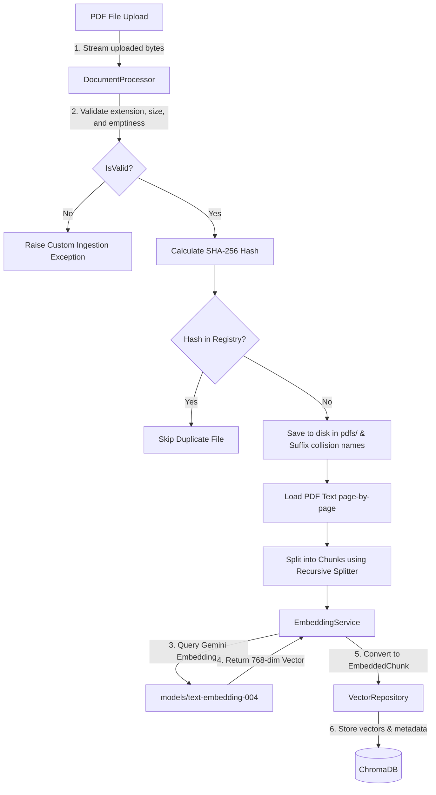
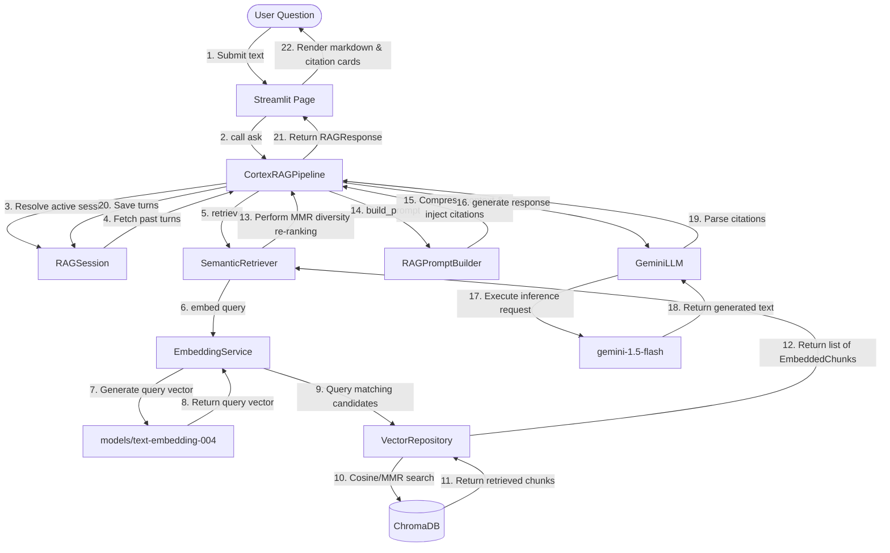

# Comprehensive System Architecture

This document describes the architectural flow, component relationships, and software engineering principles of the Cortex AI RAG system.

---

## 1. End-to-End System Diagrams

Cortex AI partitions tasks into two main workflows: **Document Ingestion** and **Conversational Query Retrieval (RAG)**.

### Ingestion Flow

### Query and Retrieval Flow

---

## 2. Decoupled Service Layers

* **Presentation Layer (`ui/`)**: Reusable UI blocks and multi-page configurations using Streamlit.
* **Orchestration Layer (`core/rag/`)**: Coordinates conversational state context and coordinates pipelines (`CortexRAGPipeline`, `RAGSession`).
* **Domain Layer (`core/`)**:
  * **`EmbeddingService`**: Embeds text using pluggable providers and caches vector calculations.
  * **`SemanticRetriever`**: Implements MMR and Similarity algorithms.
  * **`RAGPromptBuilder`**: Templates instructions and enforces token-character budgets.
  * **`GeminiLLM`**: Wrapper around Google Gemini API featuring exponential backoff.
  * **`DocumentProcessor`**: Orchestrates PDF loading, page sanitization, validation, hashing, and character chunking.
* **Data Storage Layer (`core/vector_store/` & `core/repository/`)**:
  * **`VectorRepository`**: Manages writes, updates, rollback states, collection versioning, and statistics calculations.
  * **`ChromaVectorStore`**: Adapter for persistent ChromaDB client transactions.
