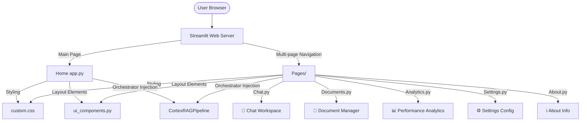

# Professional Streamlit Frontend Documentation

This document explains the user interface architecture, Streamlit session state management, component hierarchies, and visual styles implemented in the Cortex AI frontend.

---

## 1. UI Architecture

The frontend is implemented as a **multi-page Streamlit application** centered around a shared state. It is separated into presentation scripts, style sheets, and reusable components.

---

## 2. Page Directory Map

* **`ui/app.py` (Home)**: Landing page with product descriptions, visual workflow graphs, quick start steps, and a live health monitoring panel check.
* **`ui/pages/1_💬_Chat.py`**: Conversational interface supporting query submissions, answer streaming simulations, copy functions, regenerations, and expandable citation preview panels.
* **`ui/pages/2_📂_Documents.py`**: PDF drag-and-drop uploader. Automatically handles validation, hashing, chunking, and database indexing.
* **`ui/pages/3_📊_Analytics.py`**: Displays performance charts detailing average response times, retriever latencies, and cache efficiency hits.
* **`ui/pages/4_⚙_Settings.py`**: Exposes sliders for LLM temperature, Top-K, MMR lambda, similarity thresholds, and a hard database purge utility.
* **`ui/pages/5_ℹ_About.py`**: Shows tech stack components and licenses.

---

## 3. Component Hierarchy

All pages leverage reusable components defined in `ui/components/ui_components.py`:
- **`inject_custom_css()`**: Injects the premium dark slate stylesheet at page setup.
- **`render_header()`**: Renders uniform title banners with linear gradient headings.
- **`render_footer()`**: Renders persistent credentials at the page bottom.
- **`render_metric_card()`**: Glassmorphic stats container displaying numbers with high-contrast text.
- **`render_citation_card()`**: Creates expandable boxes highlighting the source name, page number, similarity score, and a preview of the text chunk.
- **`render_health_dot()`**: Status indicator dot (Emerald green for active, red for outage).

---

## 4. State Management (Session State)

Streamlit re-runs scripts from top to bottom on every user interaction. To persist variables across runs and pages, we use `st.session_state`:

* **`st.session_state.pipeline`**: Persists the single `CortexRAGPipeline` instance. Initialized once at app start.
* **`st.session_state.chat_session_id`**: Persists the unique conversation session ID (UUIDv4) to keep chat history isolated.
* **`st.session_state.messages`**: Stores the list of message dicts rendered in the Chat page. Keeps track of assistant answers and citation attributes across page switches.
