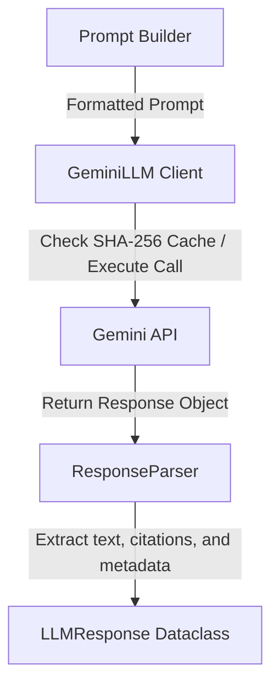

# LLM Service Layer Documentation

This document explains language model connectivity, Google Gemini client integrations, safety settings, stream parsing, and the design of the Cortex AI LLM Service layer.

---

## 1. Google Gemini Integration

The LLM Service integrates with Google Gemini models (e.g. `gemini-1.5-flash` or `gemini-pro`) using the official Python SDK (`google-generativeai`).

To support modularity and configurability, the client configuration loads settings from `utils/config.py` and environment configurations:
- **`GOOGLE_API_KEY`**: Authenticates requests to Google's API gateways.
- **`DEFAULT_LLM_MODEL`**: Centralizes the model version used across the workspace.

---

## 2. Why a Response Parser Exists

Raw outputs from model APIs contain various metadata structures (prompt feedback, candidate listings, finish reason enumerations) that differ between providers (OpenAI, Claude, Gemini).

The **`ResponseParser`** serves to:
- **De-clutter Business Logic**: Normalizes model-specific classes into a standard, clean Python data structure (`LLMResponse`).
- **Isolate Safety Audits**: Analyzes prompt feedback and candidate blocks to catch blocks early, raising `SafetyBlockException`.
- **Extract Citations**: Inspects output strings using regular expressions to extract list structures containing unique document references (e.g., `[Source: document.pdf, Page 12]`).
- **Measure Performance**: Attaches token estimates and elapsed latency measurements to the response container.

---

## 3. Distance and Generation Parameters

The model configuration exposes variables to tune inference:
- **`temperature`** (default `0.2`): Controls response randomness. Lower values are preferred in RAG to enforce factual accuracy.
- **`top_p`** (default `0.95`) & **`top_k`** (default `40`): Restricts vocab selection boundaries during inference.
- **`max_output_tokens`** (default `2048`): Enforces length limits on the model's answer.
- **`timeout`** (default `30.0`): Connection timeout boundaries.

---

## 4. Exponential Backoff Retry Strategy

To maintain high availability and robustness in production environments, the client implements a **custom retry handler** using exponential backoff:
1. If the API throws transient error codes (e.g., `429 Rate Limit Exceeded`, `503 Service Unavailable`, or `Deadline Exceeded`), the client catches the error.
2. It pauses execution for a delay calculated as:
   $$\text{Delay} = \text{base\_delay} \times 2^{\text{attempt}}$$
3. The client retries the request up to 3 times before raising specific exceptions (`RateLimitException` or `LLMTimeoutException`).

---

## 5. Architectural Pipeline

---

## 6. Streaming Generation

For real-time user experiences, the client exposes `generate_stream(self, prompt)` which configures `stream=True` on the Gemini client. It yields string tokens as they are generated by the model, enabling typewriter-style output in user interfaces.
