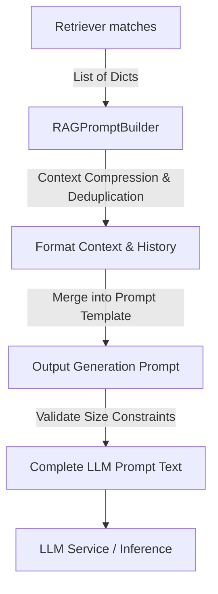

# Prompt Engineering Layer Documentation

This document explains prompt engineering, context budgeting, hallucination prevention strategies, citation formatting guidelines, and prompt template structures in Cortex AI.

---

## 1. Why Prompt Engineering Matters in RAG

**Prompt Engineering** in a Retrieval-Augmented Generation (RAG) architecture is the final bridge between the database indices and the LLM. 

Even if the retriever finds highly relevant documents, the system will fail or hallucinate if the LLM is not instructed on:
- How to prioritize the retrieved context relative to its baseline training.
- How to cite its sources.
- How to handle questions that fall outside the context scope.

---

## 2. Hallucination Prevention

Large Language Models naturally tend to "hallucinate" (fabricate facts) when answering questions outside their training data or context limits. The prompt engineering layer implements the following system instruction safety rules to prevent this:

* **Strict Context Boundary**: Explicitly instructs the model: *"answer the user's question using only the provided context."*
* **Fallback Assertion**: Instructs the model: *"If the answer cannot be found in the provided context, state: 'I cannot answer this based on the provided context.' Do not make up facts or hallucinate."*
* **Fact Grounding**: Prompts require that every claim made in the output must be backed by an inline source citation.

---

## 3. Source Citation Formatting

To support verification and audits, the builder formats every context document chunk with its source citation:
```text
Document Chunk:
[Text content of chunk]
Citation: [Source: file_name.pdf, Page: 12]
---
```
By structuring the retrieved context with explicit `Citation:` tags, the model learns the template naturally and outputs citations at the end of its response sentences.

---

## 4. Token & Character Budgeting

LLMs have strict input context window bounds (tokens). To prevent the system from sending oversized prompts:

* **Context Character Budgeting**: The builder restricts the total size of the retrieved context to `max_context_chars` (default `5000` chars).
* **Chunk Prioritization**: Chunks are sorted by similarity score descending. Chunks are appended one by one until the budget limit is reached.
* **Granular Truncation**: If a chunk exceeds the remaining character budget, it is truncated, and a `[Truncated to fit context budget]` warning is appended.
* **Hard Prompt Ceiling**: If the final assembled prompt exceeds `max_prompt_chars` (default `10000` chars) due to long queries or history, the builder raises `PromptTooLargeException` before any API call is made.

---

## 5. Architectural Pipeline



---

## 6. Prompt Templates

The system maintains a template registry managed by `PromptTemplateManager`:

1. **`qa` (Question Answering)**: Standard RAG prompt for answering direct questions.
2. **`summary` (Summarization)**: Generates executive summaries of documents.
3. **`compare` (Comparison)**: Compares products, metrics, or points mentioned in the context.
4. **`explain` (Explain Concept)**: Explains technical jargon or processes in simple terms.
5. **`bullets` (Bullet Summary)**: Summarizes context as a bulleted list with citations.
