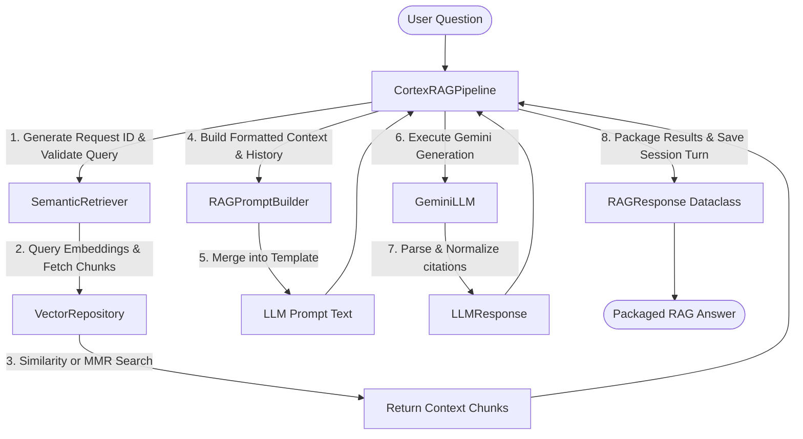

# Complete RAG Pipeline Orchestrator Documentation

This document explains the orchestration workflow, session state tracking, telemetry collection, dependency injection structure, and error propagation patterns of the Cortex AI RAG Pipeline.

---

## 1. Pipeline Orchestration Workflow

The **`CortexRAGPipeline`** serves as the central orchestration controller of the application. It coordinates individual services (document loader, embedding services, vector repository, semantic retriever, prompt builder, and LLM services) into an automated RAG workflow.

---

## 2. Request Lifecycle and Tracing

To ensure observability and troubleshooting capabilities, the pipeline implements **Request Tracing**:
- For every query received by `ask()`, the orchestrator generates a unique `request_id` (a UUIDv4 string).
- This `request_id` is logged at the start, during retrieval, prompt assembly, LLM execution, and response compilation stages.
- If any service throws an exception, the logs capture the error with the `request_id` to allow quick tracing.

---

## 3. Dependency Injection

The pipeline uses strict constructor Dependency Injection:
- Concrete services are instantiated externally (e.g. using `RAGFactory`) and passed to `CortexRAGPipeline`.
- This decouples orchestration from the implementation details of any single module.
- It enables testing components in isolation using mocks, as demonstrated in `tests/test_rag_pipeline.py`.

---

## 4. Conversation Sessions and Memory

State management is handled by **`RAGSession`** (defined in `rag_session.py`):
- **Turn-based Dialog Log**: Stores lists of query/answer message histories (`user` and `assistant`).
- **Memory Preservation**: The pipeline resolves active session IDs. The history is passed to `RAGPromptBuilder` to compile conversation context, allowing the LLM to follow up on previous turns.
- **Session Telemetry**: Tracks session age, update timestamps, and total conversation turns.
- **Context Resets**: Allows users to clear session histories programmatically.

---

## 5. Performance Statistics Aggregation

The orchestrator aggregates performance telemetry:
- **`questions_asked`**: Count of questions processed.
- **`average_response_time`**: Mean duration of the entire ask request (retrieval + prompt assembly + inference).
- **`average_retrieval_time`**: Average latency of similarity/MMR searches.
- **`average_generation_time`**: Average latency of Gemini API calls.
- **`average_chunks_retrieved`**: Average number of context passages found per question.
- **`cache_efficiency`**: Hits/misses ratios extracted from `SemanticRetriever`.
- **`total_indexed_documents`**: Total unique file counts indexed in the database (resolved from `VectorRepository`).
