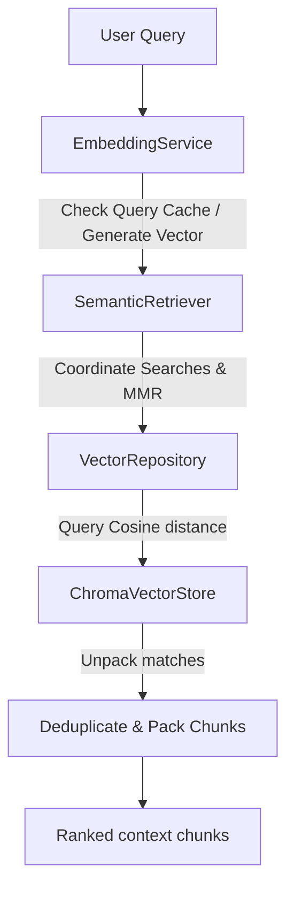

# Semantic Retrieval Documentation

This document explains semantic document retrieval, ranking algorithms, Cosine metrics, Maximum Marginal Relevance (MMR), caching strategies, and the design of the Cortex AI Retriever layer.

---

## 1. What is Semantic Retrieval?

**Semantic Retrieval** is the process of retrieving document passages that match the *intent* and *context* of a user's question, rather than just matching character combinations or tokens. 

In a Retrieval-Augmented Generation (RAG) system, retrieval acts as the filter that extracts a concise, highly relevant subset of data from a massive knowledge base, which is then fed directly into the Prompt Builder for LLM context.

---

## 2. Keyword Search vs. Semantic Search

| Feature | Keyword Search (BM25 / TF-IDF) | Semantic Search (Vector Embedding Space) |
| :--- | :--- | :--- |
| **Matching Rule** | Lexical matching (exact characters/words). | Conceptual similarity (distance in high-dimensional vector spaces). |
| **Synonyms** | Fails unless synonyms are explicitly indexed. | Automatically handles synonyms (e.g. "profits" and "earnings" map close together). |
| **Context Aware** | Very low (treats words as independent tokens). | High (encodes the entire sentence/paragraph structure). |
| **Compute Cost** | Low (uses inverted index lookups). | Medium (requires vector generation and vector distance calculations). |

---

## 3. Distance Metrics & Cosine Similarity

To match queries against documents, query text is converted into a $768$-dimensional vector embedding using the configured model (`models/text-embedding-004`).

We calculate the **Cosine Similarity** between query vector $\mathbf{u}$ and candidate vector $\mathbf{v}$:
$$\text{Cosine Similarity}(\mathbf{u}, \mathbf{v}) = \frac{\mathbf{u} \cdot \mathbf{v}}{\|\mathbf{u}\| \|\mathbf{v}\|}$$

* A score of `1.0` represents identical directions.
* Standard similarity retrieval returns chunks sorted in descending order of this score.
* The system allows configuring `score_threshold` parameters to discard chunks below a certain similarity confidence bounds.

---

## 4. Maximum Marginal Relevance (MMR)

While standard similarity search retrieves the closest matches, it often retrieves duplicate or highly redundant information (e.g. three chunks stating the same fact).

To resolve this, the system implements **Maximum Marginal Relevance (MMR)**. 

MMR aims to maximize **relevance** to the query while maximizing **diversity** of the selected documents. Given a query vector $Q$, candidates $C$, and already selected set $S$, the next chunk $D_i \in C \setminus S$ is chosen by maximizing:
$$\text{MMR}(D_i) = \lambda \cdot \text{Sim}(D_i, Q) - (1 - \lambda) \cdot \max_{D_j \in S} \text{Sim}(D_i, D_j)$$

* $\lambda$ (Lambda, default `0.5`) acts as the diversity factor:
  - If $\lambda = 1.0$, it becomes standard similarity search (no diversity penalty).
  - If $\lambda = 0.0$, it selects completely diverse candidates relative to what is already selected.

---

## 5. Architectural Pipeline

---

## 6. Integration and Extensibility

* **Dependency Injection**: `SemanticRetriever` receives both `EmbeddingService` and `VectorRepository` via constructor parameters, making it decoupled from concrete database wrappers or model instances.
* **Provider-Agnostic MMR**: Since candidate vectors are needed for MMR distance calculations, the retriever queries `EmbeddingService.embed_text()` to get candidate embeddings. Because of the embedding service's fast hash-cache, this has a $100\%$ cache-hit rate, meaning it is fast and requires no vendor-specific database calls.
* **Factory Pattern**: `RetrieverFactory` instantiates retrievers based on configurations, allowing hybrid search rankers to be added in the future.
