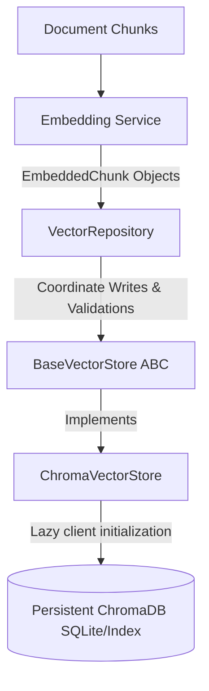

# Vector Store and Repository Layer Architecture Documentation

This document explains vector database storage, the choice of ChromaDB, similarity metrics, metadata filtering, local persistence, and the design of the Cortex AI Vector Repository layer.

---

## 1. Why Vector Databases?

Traditional relational databases (like PostgreSQL, MySQL) index data using columns, strings, or numbers, and query them via exact matching. Full-text search (like Elasticsearch) indexes documents based on tokenized keywords.

Neither relational databases nor keyword search models can understand the **semantic meaning** of text chunks. 

**Vector Databases** index high-dimensional vector representations (embeddings) of text. They organize items based on geometric proximity in a vector space. By performing nearest-neighbor searches (e.g., using Cosine Similarity), they retrieve passages that share conceptual meaning with a query, even if they share zero keywords in common.

---

## 2. Why ChromaDB?

ChromaDB is a lightweight, open-source vector database tailored for building AI applications with LLMs:
- **Developer-Friendly**: Provides a native Python SDK that integrates with standard tools.
- **Embedded Mode**: Can run directly inside the Python application process, storing records locally in a SQLite database without needing a separate Docker container or cloud database service.
- **Rich Querying**: Supports complex metadata filtering conditions (`where` clauses) and text document search out of the box.
- **HNSW Indexing**: Uses Hierarchical Navigable Small World (HNSW) graphs, enabling retrieval in logarithmic time.

---

## 3. Cosine Similarity Space

To measure similarity between a query vector $\mathbf{u}$ and database vector $\mathbf{v}$, the service uses **Cosine Similarity**:
$$\text{Cosine Similarity}(\mathbf{u}, \mathbf{v}) = \frac{\mathbf{u} \cdot \mathbf{v}}{\|\mathbf{u}\| \|\mathbf{v}\|}$$

ChromaDB collections are initialized using the `cosine` distance space.
- ChromaDB calculates **Cosine Distance**: $\text{Distance} = 1.0 - \text{Cosine Similarity}$.
- The service maps this distance back to similarity space: $\text{Similarity Score} = 1.0 - \text{Distance}$.
- This normalizes similarity scores to range between $[-1.0, 1.0]$ (where $1.0$ is identical direction).
- The service supports `score_threshold` parameters to filter out low-confidence nearest-neighbors.

---

## 4. Ingest & Search Pipeline Dataflow

The Vector Store Layer incorporates the **Repository Pattern** to cleanly separate indexing orchestration from storage-specific implementation details.

---

## 5. Architectural Improvements

### A. Repository Pattern (`VectorRepository`)
The repository layer handles coordination and validation of incoming data:
* **Decoupled Business Logic**: Prevents business logic from directly depending on ChromaDB APIs. All operations are mediated through the injected `BaseVectorStore` instance.
* **Validation Layer**: Asserts batch inputs before database writes. Checks for:
  - Empty input lists
  - Missing text strings or empty document chunks
  - Missing embedding vectors or dimension length conflicts
  - Missing tracking metadata fields
  - Duplicate chunk IDs within the write batch list

### B. Collection Metadata Manager
Every collection preserves key metadata fields within its registry:
* `collection_name`: Unique registry key.
* `collection_version`: Semantic version.
* `embedding_provider` & `embedding_model`: Identifies creator vendor and model properties (e.g., `'Google Gemini'`, `'models/text-embedding-004'`).
* `embedding_dimension`: Width of vectors (e.g. `768`).
* `created_at` & `updated_at`: Timestamps.
* `total_documents`, `total_chunks`, `total_vectors`: Counters.

### C. Version Management & Re-indexing
To support re-indexing (for example, when switching embedding model configurations), the repository tracks major semantic versions:
* **Compatibility Check**: Compares collection version strings. If the major versions do not match (e.g. upgrading from `1.0.0` to `2.0.0`), queries or inserts warn or raise exceptions.
* **Version Upgrade**: Exposes `upgrade_collection_version()` to increment versions programmatically after re-indexing completes.

### D. Transaction Support & Rollback Simulation
ChromaDB does not support native multi-row transactions. The repository implements a transaction coordinator to maintain indexing integrity:
* **Atomic Batch Simulation**: During `add_embeddings`, if the validation or insertion of a batch fails halfway:
  - The repository catches the error and logs the details.
  - It triggers a **rollback routine**, invoking `delete_embeddings` for all chunk IDs present in that failed batch to ensure no partial records remain in the database index.

### E. Index Statistics Tracking
The repository aggregates metrics and indexes them for auditing:
* **`total_indexed_documents`**: Cumulative count of unique file hashes successfully stored.
* **`total_indexed_chunks`**: Cumulative chunk counts.
* **`duplicate_chunks_skipped`**: Tracks skipped duplicate entries.
* **`average_indexing_time`**: Average processing latency per batch call.
* **`failed_insertions`**: Number of failed batch attempts.
* **`collection_size`**: Current vector count inside the collection.
* **`last_indexing_timestamp`**: Timestamp of the last write.

---

## 6. Integration and Extensibility

The Vector Store Layer is designed for provider extensibility (similar to Module 4's embedding provider interface):
- `BaseVectorStore` establishes the abstract interface.
- `VectorStoreFactory` instantiates the database manager dynamically (e.g., calling `VectorStoreFactory.get_vector_store("chromadb")`).
- Future production vector databases (like **Pinecone**, **Weaviate**, **Qdrant**, or **Milvus**) can be added by subclassing `BaseVectorStore` without modifying the core ingest pipelines or retriever interfaces.
